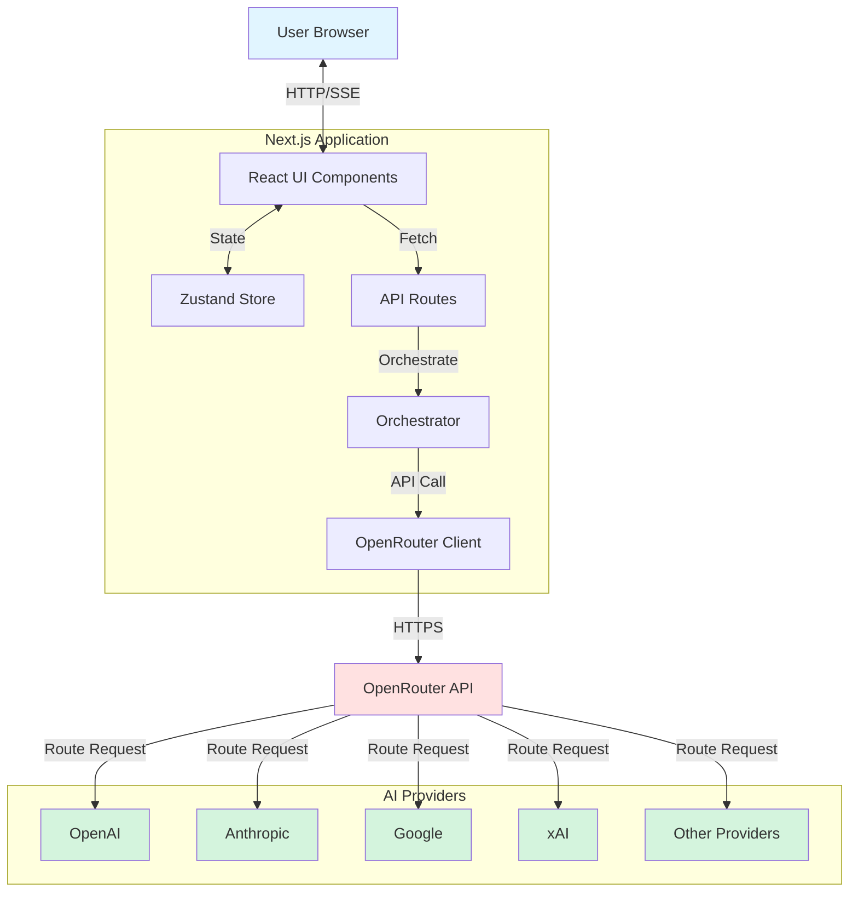
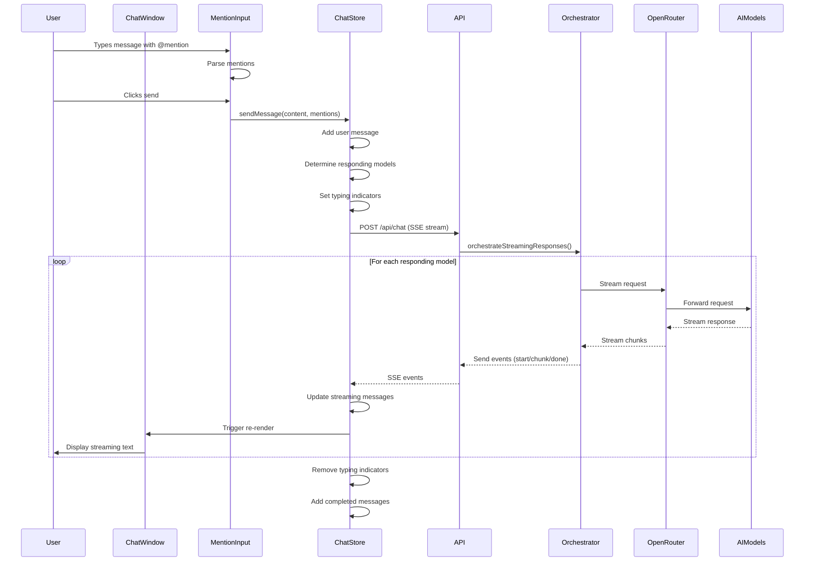
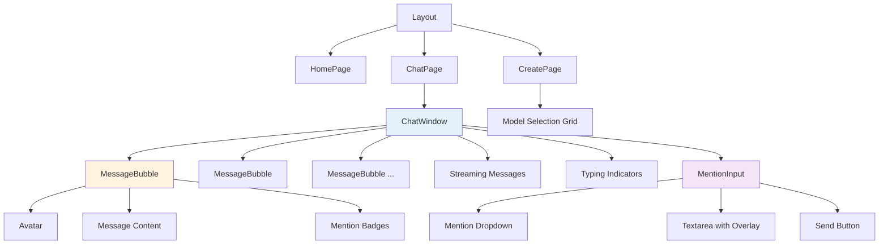
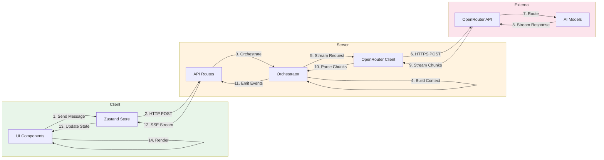

# AI Group Chat - Architecture Documentation

## Table of Contents
1. [Overview](#overview)
2. [Tech Stack](#tech-stack)
3. [Project Structure](#project-structure)
4. [Architecture Diagrams](#architecture-diagrams)
5. [Data Flow](#data-flow)
6. [Component Details](#component-details)
7. [API Routes](#api-routes)
8. [State Management](#state-management)
9. [Key Features](#key-features)

---

## Overview

AI Group Chat is a Next.js application that enables users to chat with multiple AI models simultaneously. It supports two modes:
- **Regular Mode**: One-on-one conversation with a single model
- **Debate Mode**: All selected models respond to every message, creating a group discussion

### Core Capabilities
- Real-time streaming responses from AI models
- @mentions system (similar to Discord)
- Support for multiple AI providers via OpenRouter
- Persistent chat history
- Visual model avatars and branding

---

## Tech Stack

```
┌─────────────────────────────────────────────┐
│           Frontend & Backend                │
├─────────────────────────────────────────────┤
│  Next.js 16 (App Router)                    │
│  React 19                                   │
│  TypeScript                                 │
│  Tailwind CSS v4                            │
└─────────────────────────────────────────────┘
                    │
                    ▼
┌─────────────────────────────────────────────┐
│         State Management                    │
├─────────────────────────────────────────────┤
│  Zustand (client-side state)                │
└─────────────────────────────────────────────┘
                    │
                    ▼
┌─────────────────────────────────────────────┐
│         External Services                   │
├─────────────────────────────────────────────┤
│  OpenRouter API (AI model aggregator)       │
│    - OpenAI (GPT-4, GPT-3.5)                │
│    - Anthropic (Claude)                     │
│    - Google (Gemini)                        │
│    - Meta (Llama)                           │
│    - xAI (Grok)                             │
│    - Many more...                           │
└─────────────────────────────────────────────┘
```

---

## Project Structure

```
ai-gc/
├── app/                          # Next.js App Router
│   ├── api/                      # API routes
│   │   ├── chat/                 # Chat API endpoint
│   │   │   └── route.ts          # POST /api/chat (streaming)
│   │   └── models/               # Models API endpoint
│   │       └── route.ts          # GET /api/models
│   ├── chat/[id]/                # Dynamic chat page
│   │   └── page.tsx              # Individual chat view
│   ├── create/                   # Chat creation page
│   │   └── page.tsx              # Model selection UI
│   ├── page.tsx                  # Home page
│   ├── layout.tsx                # Root layout
│   └── globals.css               # Global styles
│
├── components/                   # React components
│   ├── chat/                     # Chat-related components
│   │   ├── chat-window.tsx       # Main chat interface
│   │   ├── message-bubble.tsx    # Individual message display
│   │   ├── mention-input.tsx     # Input with @mention support
│   │   └── index.ts              # Exports
│   └── ui/                       # Reusable UI components
│       ├── button.tsx
│       ├── badge.tsx
│       └── ...
│
├── lib/                          # Core business logic
│   ├── orchestrator.ts           # Message orchestration
│   ├── openrouter.ts             # OpenRouter API client
│   └── fetch-models.ts           # Model fetching utilities
│
├── store/                        # State management
│   └── chat-store.ts             # Zustand store for chats
│
├── types/                        # TypeScript types
│   ├── index.ts                  # Main type exports
│   └── message.ts                # Message types
│
├── docs/                         # Documentation
│   └── ARCHITECTURE.md           # This file
│
└── public/                       # Static assets
    └── models/                   # Model logos
```

---

## Architecture Diagrams

### 1. High-Level System Architecture



### 2. Message Flow Diagram



### 3. Component Hierarchy



### 4. Data Flow Architecture



---

## Data Flow

### User Message Flow

1. **User Input**
   - User types message in `MentionInput`
   - Component detects `@` symbol and shows dropdown
   - User selects model(s) or @everyone
   - User clicks send button

2. **Message Processing**
   - `MentionInput` extracts mentions from text
   - Calls `ChatStore.sendMessage(content, mentions)`
   - Store creates user message with metadata
   - Store determines which models should respond:
     - Debate mode OR @everyone: all models
     - Specific @mentions: only mentioned models
     - Default: first model only

3. **API Request**
   - Store sends POST to `/api/chat` with:
     - User message
     - Conversation history
     - Model IDs
     - Debate mode flag
   - API creates Server-Sent Events (SSE) stream

4. **Orchestration**
   - `orchestrator.ts` receives request
   - For each responding model:
     - Builds model-specific context
     - Adds appropriate system prompt
     - Calls OpenRouter API with streaming

5. **Streaming Response**
   - OpenRouter streams chunks from AI model
   - Orchestrator emits events:
     - `start`: Model begins responding
     - `chunk`: New text chunk received
     - `done`: Model finished responding
     - `error`: Something went wrong

6. **State Updates**
   - Store listens to SSE stream
   - Updates `streamingMessages` for live text
   - Removes typing indicators
   - Adds completed messages to chat history

7. **UI Rendering**
   - `ChatWindow` re-renders on state changes
   - `MessageBubble` displays completed messages
   - Streaming messages show live with cursor
   - Auto-scrolls to bottom

---

## Component Details

### ChatWindow (`components/chat/chat-window.tsx`)

**Purpose**: Main chat interface container

**Key Features**:
- Displays message history
- Shows streaming messages in real-time
- Displays typing indicators
- Handles auto-scrolling
- Renders `MentionInput` for user input

**Props**:
```typescript
interface ChatWindowProps {
  chatId: string;  // ID of current chat
}
```

**State**:
- Fetches all available models on mount
- Subscribes to Zustand store for:
  - Messages array
  - Typing models
  - Streaming messages

---

### MessageBubble (`components/chat/message-bubble.tsx`)

**Purpose**: Renders a single message

**Key Features**:
- Different styling for user vs AI messages
- Shows model avatar and name
- Highlights @mentions with Discord-like styling
- Displays timestamp
- Shows @everyone badge

**Props**:
```typescript
interface MessageBubbleProps {
  message: Message;
  allModels?: Model[];
  isStreaming?: boolean;  // If true, shows as streaming
}
```

**Mention Rendering**:
- Uses regex to find @mentions in text
- Validates mentions against available models
- Applies purple Discord-style highlighting

---

### MentionInput (`components/chat/mention-input.tsx`)

**Purpose**: Text input with @mention autocomplete

**Key Features**:
- Detects `@` symbol and shows dropdown
- Filters models by search query
- Keyboard navigation (Arrow keys, Enter, Tab, Escape)
- Highlights mentions in input with overlay technique
- Sends message on Enter (Shift+Enter for new line)

**Props**:
```typescript
interface MentionInputProps {
  onSend: (message: string, mentions: MentionData[]) => void;
  disabled?: boolean;
  chatModelIds?: string[];  // Filter to chat's models
}
```

**Technical Implementation**:
- Uses overlay technique for highlighting
- Transparent textarea on top of styled div
- Caret visible, text transparent
- Highlighted mentions shown in overlay

---

## API Routes

### POST `/api/chat`

**Purpose**: Send message and stream AI responses

**Request Body**:
```typescript
{
  chatId: string;
  message: string;
  modelIds: string[];
  debateMode: boolean;
  conversationHistory: Array<{
    role: "user" | "assistant";
    content: string;
    modelId?: string;
  }>;
}
```

**Response**: Server-Sent Events (SSE) stream

**Event Types**:
```typescript
// Model starts responding
{ type: "start", modelId: string }

// New text chunk
{ type: "chunk", modelId: string, content: string }

// Model finished
{ type: "done", modelId: string, fullContent: string }

// Error occurred
{ type: "error", modelId: string, error: string }
```

**Flow**:
1. Validate request body
2. Create ReadableStream
3. Call orchestrator
4. Stream events to client
5. Send `[DONE]` and close stream

---

### GET `/api/models`

**Purpose**: Fetch available AI models from OpenRouter

**Response**:
```typescript
Model[] // Array of model objects
```

**Model Object**:
```typescript
{
  id: string;              // e.g., "openai/gpt-4o"
  displayName: string;     // e.g., "GPT-4 Omni"
  name: string;
  description?: string;
  provider: "openai" | "anthropic" | "google" | "xai" | "openrouter";
  logo: string;            // Path to logo image
  isFree: boolean;
  supportsImages: boolean;
  supportsDebate: boolean;
  pricing: {...};
  context_length: number;
}
```

**Caching**:
- Server-side cache: 1 hour
- Client-side: Fetched once on component mount

---

## State Management

### ChatStore (`store/chat-store.ts`)

**State**:
```typescript
{
  chats: Record<string, Chat>;           // All chats by ID
  activeChatId: string | null;           // Current chat
  selectedModels: string[];               // Model selection
  debateMode: boolean;                    // Debate mode toggle
  typingModels: string[];                 // Models currently typing
  streamingMessages: Record<string, StreamingMessage>;
}
```

**Key Actions**:

- `createChat(modelIds)` - Create new chat
- `sendMessage(chatId, content, mentions)` - Send message
- `addMessage(chatId, message)` - Add message to chat
- `setTypingModels(modelIds)` - Set typing indicators
- `startStreamingMessage(modelId)` - Start streaming
- `updateStreamingMessage(modelId, content)` - Append chunk
- `completeStreamingMessage(chatId, modelId, content)` - Finish streaming

**State Flow**:
```
User Action
    ↓
Component calls Store action
    ↓
Store updates state
    ↓
Components re-render
    ↓
UI updates
```

---

## Key Features

### 1. @Mention System

**How it works**:
- User types `@` in input
- Dropdown shows available models and @everyone
- User selects from dropdown or types full name
- Mentions are parsed and validated
- Messages are styled with Discord-like purple highlights

**Implementation**:
```typescript
// Regex to find mentions
const mentionRegex = /@(everyone|[\w\s.-]+?)(?=\s|$)/g;

// Extract mentions
mentions.forEach(mention => {
  if (mention === "everyone") {
    // All models respond
  } else {
    // Find matching model
  }
});
```

### 2. Debate Mode

**Regular Mode**:
- Only first selected model responds
- Each model sees only its own conversation history
- Simple back-and-forth conversation

**Debate Mode**:
- ALL selected models respond to every message
- Each model sees all other models' responses
- Responses are labeled with model names
- Creates group discussion effect

**Context Building**:
```typescript
// Debate mode context
"[GPT-4]: I think X because Y..."
"[Claude]: I disagree because Z..."

// Regular mode context
"User: Question"
"Assistant: Answer"
```

### 3. Real-Time Streaming

**Why Streaming**:
- Better user experience (text appears as generated)
- Lower perceived latency
- Can handle long responses
- Supports multiple models simultaneously

**Implementation**:
- Server-Sent Events (SSE) from server
- `ReadableStream` API
- Client listens to events and updates UI
- Separate streaming state for each model

**Visual Feedback**:
- Typing indicator while waiting
- Streaming text without cursor (cursor removed)
- Auto-scroll to latest content

### 4. Model Selection

**Features**:
- Browse all available models
- See pricing, context length, capabilities
- Filter by provider
- See which models are free
- Select multiple models for group chat

**Data Source**:
- OpenRouter API provides model list
- Cached for 1 hour
- Enriched with logos and metadata

---

## Environment Variables

Required in `.env.local`:

```bash
# OpenRouter API Key (required)
OPENROUTER_API_KEY=your_api_key_here

# Optional: Custom app info
NEXT_PUBLIC_APP_URL=http://localhost:3000
NEXT_PUBLIC_SITE_NAME=AI Group Chat
```

---

## API Communication Flow

```
┌──────────────┐
│   Browser    │
└──────┬───────┘
       │ 1. POST /api/chat
       │    {message, modelIds, history}
       ▼
┌──────────────────────┐
│   Next.js API        │
│   route.ts           │
└──────┬───────────────┘
       │ 2. orchestrateStreamingResponses()
       ▼
┌──────────────────────┐
│   Orchestrator       │
│   orchestrator.ts    │
└──────┬───────────────┘
       │ 3. For each model
       │    - Build context
       │    - Add system prompt
       │    - Stream request
       ▼
┌──────────────────────┐
│   OpenRouter Client  │
│   openrouter.ts      │
└──────┬───────────────┘
       │ 4. POST https://openrouter.ai/api/v1/chat/completions
       │    {model, messages, stream: true}
       ▼
┌──────────────────────┐
│   OpenRouter API     │
└──────┬───────────────┘
       │ 5. Route to provider
       ▼
┌──────────────────────┐
│   AI Model           │
│   (GPT/Claude/etc)   │
└──────┬───────────────┘
       │ 6. Stream response
       ▼
┌──────────────────────┐
│   OpenRouter API     │
└──────┬───────────────┘
       │ 7. Stream chunks
       ▼
┌──────────────────────┐
│   OpenRouter Client  │
└──────┬───────────────┘
       │ 8. Parse chunks
       │    emit events
       ▼
┌──────────────────────┐
│   Orchestrator       │
└──────┬───────────────┘
       │ 9. Send SSE events
       │    {type, modelId, content}
       ▼
┌──────────────────────┐
│   API Route          │
└──────┬───────────────┘
       │ 10. Server-Sent Events
       │     data: {type: "chunk", ...}
       ▼
┌──────────────────────┐
│   ChatStore          │
└──────┬───────────────┘
       │ 11. Update state
       │     - streamingMessages
       │     - messages
       ▼
┌──────────────────────┐
│   React Components   │
└──────┬───────────────┘
       │ 12. Re-render
       ▼
┌──────────────────────┐
│   Browser UI         │
│   (User sees text)   │
└──────────────────────┘
```

---

## Type System

### Core Types

**Message** (`types/message.ts`):
```typescript
interface Message {
  id: string;
  role: "user" | "assistant";
  content: string;
  modelId?: string;
  timestamp: Date;
  isEveryoneMention?: boolean;
  mentions?: MentionData[];
  targetedModelIds?: string[];
}
```

**MentionData**:
```typescript
interface MentionData {
  type: "everyone" | "model";
  modelId?: string;
  displayName: string;
}
```

**Chat**:
```typescript
interface Chat {
  id: string;
  modelIds: string[];
  messages: Message[];
  createdAt: Date;
  updatedAt: Date;
}
```

**StreamingMessage**:
```typescript
interface StreamingMessage {
  id: string;
  modelId: string;
  content: string;  // Accumulated content
}
```

---

## Error Handling

### API Level
- Validates request body
- Catches OpenRouter API errors
- Returns user-friendly error messages
- Includes provider-specific error hints

### Client Level
- Try-catch in store actions
- Error events in SSE stream
- Fallback error messages in UI
- Graceful degradation

### Error Messages
```typescript
// Provider down
"⚠️ GPT-4 is currently unavailable. The model provider is experiencing issues."

// API key issue
"⚠️ GPT-4 is currently unavailable. API key issue detected."

// Generic error
"⚠️ GPT-4 is currently unavailable. (error details)"
```

---

## Future Enhancements

Potential areas for expansion:

1. **Persistence**
   - Database integration (PostgreSQL/MongoDB)
   - User authentication
   - Chat history persistence

2. **Advanced Features**
   - Image support (vision models)
   - File uploads
   - Code syntax highlighting
   - Export conversations

3. **UI Improvements**
   - Dark/light theme toggle
   - Custom model avatars
   - Message reactions
   - Search functionality

4. **Performance**
   - Message pagination
   - Virtual scrolling
   - Optimistic UI updates
   - Better caching strategies

5. **Collaboration**
   - Share chat links
   - Multi-user chats
   - Real-time collaboration

---

## Development Guide

### Running Locally

1. Install dependencies:
```bash
npm install
```

2. Create `.env.local`:
```bash
OPENROUTER_API_KEY=your_key_here
```

3. Run development server:
```bash
npm run dev
```

4. Open `http://localhost:3000`

### Key Files to Modify

- **Add new UI components**: `components/`
- **Modify chat logic**: `lib/orchestrator.ts`
- **Update API**: `app/api/chat/route.ts`
- **Change state**: `store/chat-store.ts`
- **Add types**: `types/`

---

## Conclusion

This architecture provides a scalable, maintainable foundation for a multi-model AI chat application. The clear separation of concerns, typed interfaces, and streaming architecture enable both great user experience and developer experience.

Key architectural decisions:
- **Next.js App Router** for modern React patterns
- **Server-Sent Events** for real-time streaming
- **Zustand** for simple, powerful state management
- **OpenRouter** for unified AI model access
- **TypeScript** for type safety and better DX

The system is designed to be extended with new features while maintaining code quality and performance.
